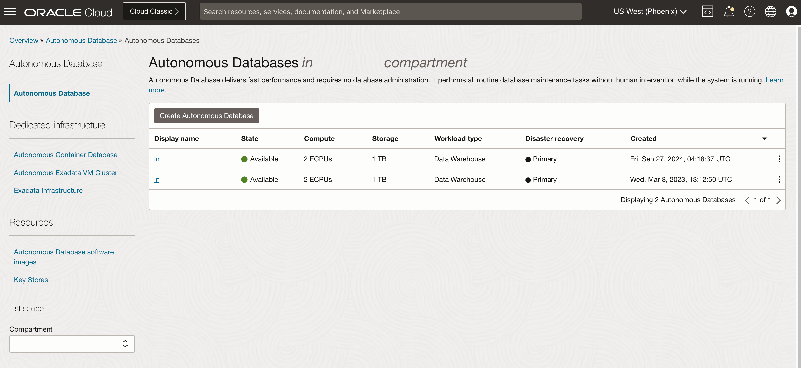
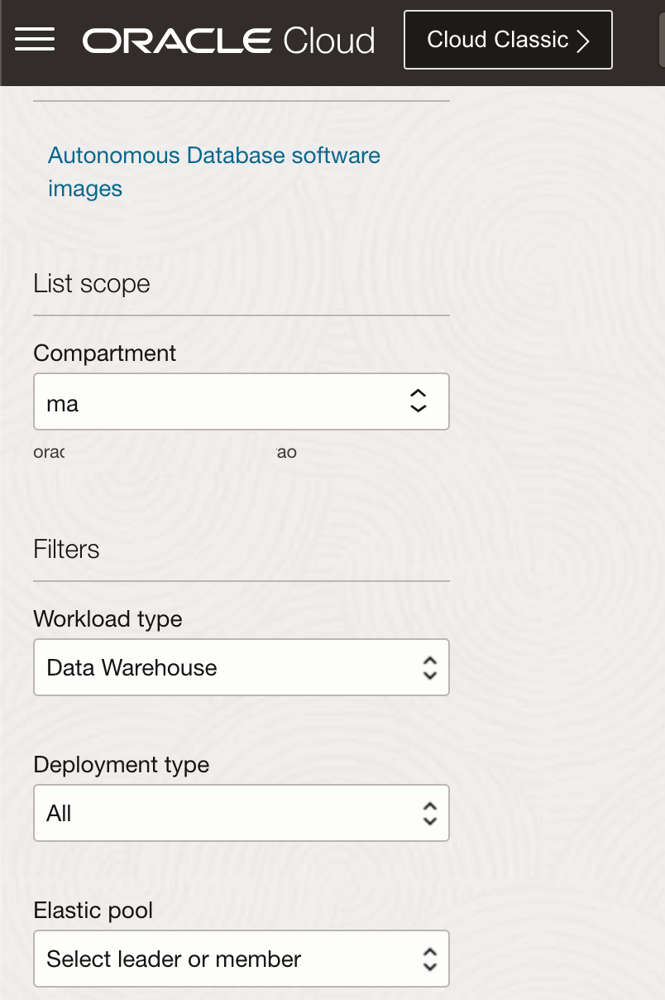
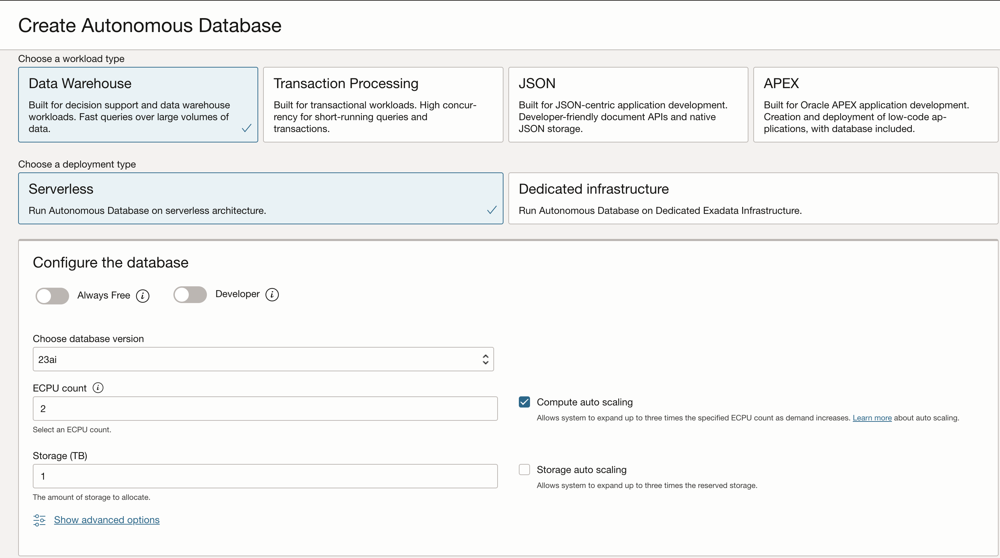
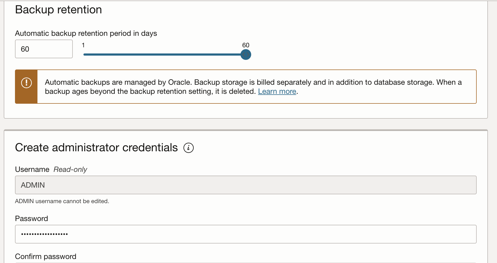
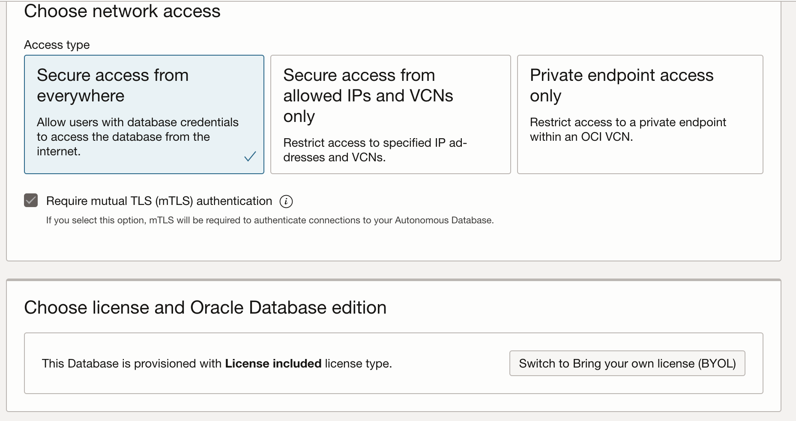
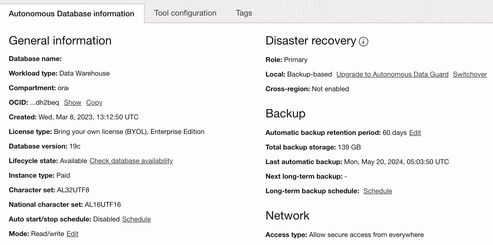
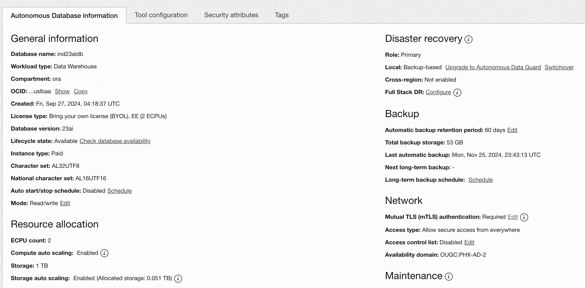
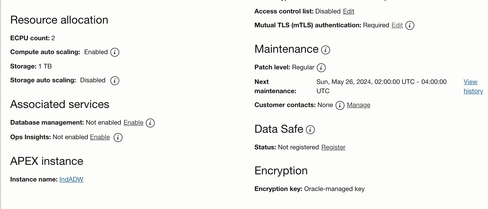
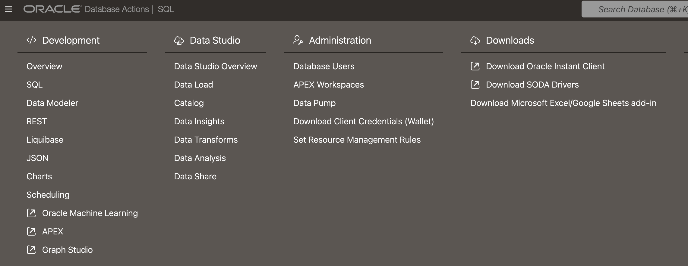
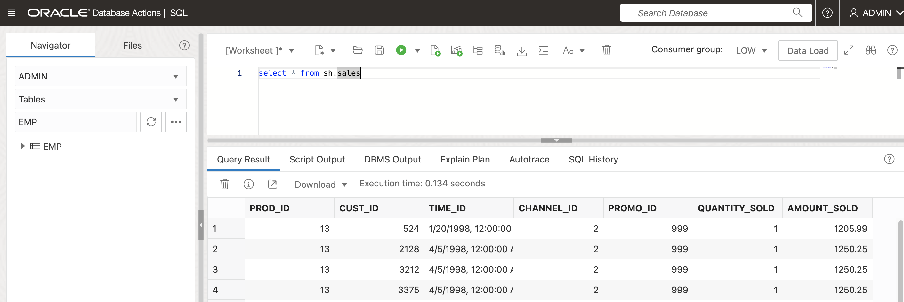

<!-- Updated April 12, 2021 -->
<!-- Updated May 21, 2024 by Madhusudhan Rao -->
# Provision Autonomous Database and Connect Using SQL Worksheet

## Introduction

This lab walks you through the steps to quickly provision an Oracle Autonomous Database on Oracle Cloud. You will use this database in subsequent labs of this workshop. In this lab, you will then connect to the database using SQL Worksheet, a browser-based tool that is easily accessible from the Autonomous Data Warehouse.

Estimated lab time: 15 minutes

### Objectives

-   Provision a new Autonomous Data Warehouse
-   Learn how to connect to your new autonomous database using SQL Worksheet

### Prerequisites

-   This lab requires completion of the **Get Started** section in the Contents menu on the left.  

## Task 1: Choose ADW from the Services Menu

1. Log in to the Oracle Cloud.
2. Once you are logged in, you are taken to the cloud services dashboard where you can see all the services available to you. Click the navigation menu in the upper left to show top level navigation choices.

      

3. Click on **Oracle Database** > **Autonomous Data Warehouse**.

    

    In the left compartment list, select the compartment where you have access to create or use an Oracle Autonomous Database Instance.

    

4. Open your compartment.  This is a logical area that only they have the privileges to update.   

    
 
    
## Task 2: Create the Autonomous Database Instance

1. Click **Create Autonomous Database** to start the instance creation process.

      

2.  This brings up the __Create Autonomous Database__ screen where you will specify the configuration of the instance.
3. Provide basic information for the autonomous database:
 
    - __Choose a compartment__ - Select a compartment for the database from the drop-down list.
    - __Display Name__ - Enter a memorable name for the database for display purposes. For this lab, use __FirstName LastName__ example (John Smith).
    - __Database Name__ - Use letters and numbers only, starting with a letter. Maximum length is 14 characters. (Underscores not initially supported.) For this lab, use __YOURNAME__ example (JOHNSMITH). 

    

4. Choose a workload type. Select the workload type for your database from the choices:

    - __Data Warehouse__ - For this lab, choose __Data Warehouse__ as the workload type.
    - __Transaction Processing__ - Alternately, you could have chosen Transaction Processing as the workload type. 
    - __Deployment Type__ - For this lab, choose __Serverless__ as the deployment type.
    - __Dedicated Infrastructure__ - Alternately, you could have chosen Dedicated Infrastructure as the workload type.
  
    <if type="freetier">
        
    </if>
    <if type="freetier23ai">   
        
    </if>

    <b>Only choose the Data Warehouse as workload type for this course.  Do not choose one of the others. Each student is only allowed 2 ECPU instance for ADW (depending upon the resources available for this lab).</b>
   
5. Configure the database:
 
    <if type="freetier">
    - __Choose database version__ - Choose - __19c__.
    </if>
    <if type="freetier23ai">   
    - __Choose database version__ - Leave default - __23ai__.
    </if>  
    - __OCPU count__ - Leave default __2 ECPU__.  
    - __Storage (TB)__ - Leave default.
    - __Compute auto scaling__ - Leave default. 
  
6. Create administrator credentials:

    - __Backup retention__ - Leave default. 

    - __Password and Confirm Password__ - Specify the password for ADMIN user of the service instance. The password must meet the following requirements:
    - The password must be between 12 and 30 characters long and must include at least one uppercase letter, one lowercase letter, and one numeric character.
    - The password cannot contain the username.
    - The password cannot contain the double quote (") character.
    - The password must be different from the last 4 passwords used.
    - The password must not be the same password that is set less than 24 hours ago.
    - Re-enter the password to confirm it. Make a note of this password.

    

    
7. Choose network access:
    - For this lab, accept the default, **Secure access from everywhere**.
   
    
    
8. Choose a license type. For this lab, choose __Bring Your Own License (BYOL)__. The two license types are:

9.  Click __Create Autonomous Database__.
 
10.  Your instance will begin provisioning. In a few minutes the state will turn from Provisioning to Available. At this point, your Autonomous Data Warehouse database is ready to use! Have a look at your instance's details here including its name, database version, CPU count and storage size.
  
    <if type="freetier">
    
    </if>
    <if type="freetier23ai">   
    
    </if>  
 
    
 
## Task 3: Connect with SQL Worksheet

Although you can connect to your autonomous database from local PC desktop tools like Oracle SQL Developer, you can conveniently access the browser-based SQL Worksheet directly from your Autonomous Data Warehouse or Autonomous Transaction Processing console.

1. In your database's details page, click the **Database Actions** button. select **SQL**

    

    You can also view the other database actions that are available.

    
 
2. The Database Actions page opens. In the **Development** box, click **SQL**.

    

5. The first time you open SQL Worksheet, a series of pop-up informational boxes introduce you to the main features. Click **Next** to take a tour through the informational boxes.

    

## Task 4: Run scripts in SQL Worksheet

Run a query on a sample Oracle Autonomous Database data set.

1. Copy and paste the code snippet below to your SQL Worksheet. This query will run on the Star Schema Benchmark (ssb.customer), one of the two ADW sample data sets that you can access from any ADW instance. Take a moment to examine the script. Make sure you click the Run Statement button to run it in SQL Worksheet so that all the rows display on the screen.

        <copy>select /* low */ c_city,c_region,count(*)
        from ssb.customer c_low
        group by c_region, c_city
        order by count(*);</copy>

    

2. Take a look at the output response from your Autonomous Data Warehouse.

3. When possible, ADW also caches the results of a query for you.  If you run identical queries more than once, you will notice a much shorter response time when your results have been cached.

4. You can find more sample queries to run in the <a href="https://www.oracle.com/autonomous-database/autonomous-data-warehouse/">ADW documentation.</a>

<!-- ## Task 5: (Optional) Provision Oracle Autonomous Database 23ai

This video shows how to provision Oracle Autonomous Database 23ai (always free) instance.

 -->

## Troubleshoot Tips

If you are having problems with any of the labs, please visit the Need Help? tab.

## Acknowledgements

* **Author** - Madhusudhan Rao, Principal Product Manager Oracle Database 
* **Author** - Marion Smith, Senior Technical Program Manager,Eugenio Galiano
* **Contributors** - Kay Malcolm, Paige Hanssen, Beda Hammerschmidt, Patrick Wheeler, Jayant  Mahto, Russ Lowenthal, Marcos Arancibia Coddou, Jayant Sharma, David Lapp, Madhusudhan Rao
* **Last Updated By/Date** - Madhusudhan Rao, Nov 26th, 2024
